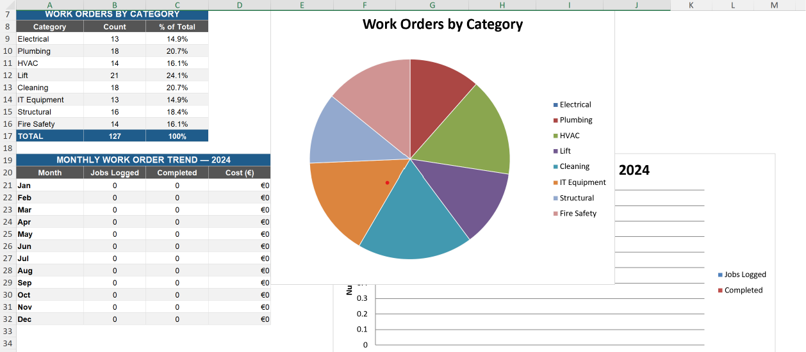

# Facilities-maintenance-Dashboard[README.md](https://github.com/user-attachments/files/29107728/README.md)
# 🏢 Facilities Maintenance Dashboard — SQL + Excel Project

**Author:** Yadvinder Punj  
**Tools:** SQL (SQLite) · Microsoft Excel · GitHub  
**Dataset:** Fictional work order data inspired by institutional facilities management (2024)

---

## 📋 Project Overview

This project analyses 12 months of facilities maintenance work orders for a large institutional building complex. The goal is to uncover patterns in maintenance activity, identify high-cost areas, evaluate contractor performance, and flag jobs that breach resolution time targets.

The dataset and findings mirror real responsibilities carried out during 5+ years as a Facilities Coordinator at the Royal College of Surgeons Ireland (RCSI).

---

## 🗂️ Files in This Repository

| File | Description |
|------|-------------|
| `facilities_sql.sql` | All SQL queries — create table, insert data, 7 analysis queries |
| `Facilities_Maintenance_Dashboard.xlsx` | Excel workbook with raw data, KPI dashboard, charts, and SQL reference |
| `README.md` | This file |

---

## 🔍 SQL Queries Included

| # | Query | Business Question |
|---|-------|-------------------|
| 1 | Jobs by category | Which maintenance type is most common? |
| 2 | Resolution time by priority | Are high-priority jobs closed faster? |
| 3 | Monthly trend | Which months are busiest and most expensive? |
| 4 | Top 3 costly categories | Where is the most money being spent? |
| 5 | Contractor performance | Which contractors are fastest and most reliable? |
| 6 | Outstanding jobs by building | Which buildings need most attention right now? |
| 7 | SLA breach analysis | Which jobs took longer than average to close? |

---

## 📊 Key Findings

- **HVAC** and **Electrical** jobs account for the highest total maintenance spend
- **High priority** jobs are resolved in an average of **5.4 days**, vs **2.9 days** for Low priority
- Job volumes peak in **Q2–Q3** (May–August), likely driven by planned summer maintenance
- **CoolAir Services** handles the most HVAC jobs but has the longest average closure time
- **3 jobs** are currently open/pending, including 1 High priority Fire Safety inspection
- 

---

## 🛠️ How to Run the SQL

1. Go to **[https://dbfiddle.uk](https://dbfiddle.uk)**
2. Select **SQLite** from the database dropdown
3. Paste the contents of `facilities_sql.sql` into the left panel
4. Click **Run** — results appear on the right

No installation needed.

---

## 📁 Excel Dashboard Features

- **KPI summary row** — total jobs, completion rate, average days to close, total spend
- **Work orders by category** — count and % breakdown
- **Priority analysis** — average cost per priority level
- **Monthly trend table** — Jan to Dec 2024
- **Bar chart** — monthly volume (logged vs completed)
- **Pie chart** — category breakdown

---

## 👤 About Me

Facilities Coordinator with 5+ years of experience at RCSI, Dublin.  
Certified in: Google Data Analytics · ICDL Professional Data Analytics · IWFM Level 4 · CompTIA Tech+ · QQI Level 6 Supervisory Management.

  
🔗 www.linkedin.com/in/yadvinder-punj
